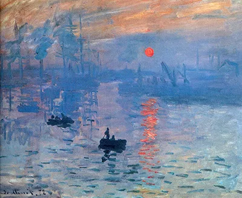

# Welcome to HengZhao's World! 🌍

<!--
> Claude Monet
-->

## About Me

👋 Hi, I'm HengZhao!  
🔭 Currently working on: **LLM System Security**  
🌱 Learning: **ML, DL, LLM**  
📫 How to reach me: [Email](mailto:hengzhao2002@gmail.com) | [X](https://x.com/Enl_Zhao)  
⚡ Fun fact: I love exploring the unknown.

<!--

-->

## My GitHub Stats

<!--
  

-->

<!--
## 🚀 Projects

### Featured Projects
- [Project 1](https://github.com/EnlZhao/project1) - 🌟 A fantastic project that does amazing things.
- [Project 2](https://github.com/EnlZhao/project2) - 🚀 Another awesome project that solves big problems.

### Open Source Contributions
- [Contribution 1](https://github.com/org/repo/pull/1) - 🛠️ Description of the contribution.
- [Contribution 2](https://github.com/org/repo/pull/2) - ✨ Description of the contribution.

-->
<!--
## 🛠️ Skills

-->
## 🌐 Connect with Me

    

Thank you for visiting my profile! Have a great day! 😊
